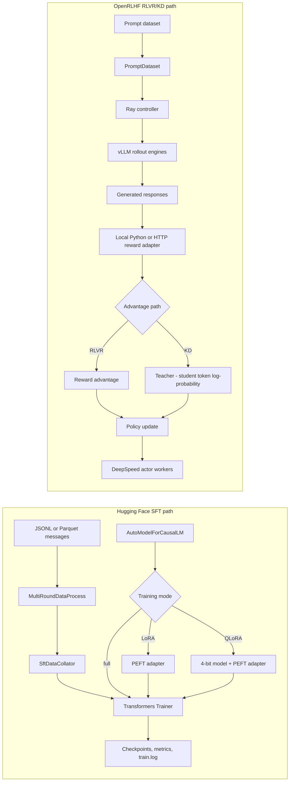

# moss

`moss` is a research workspace for experimenting with post-training large language models. The repository currently contains two independent training paths:

- a compact supervised fine-tuning (SFT) pipeline built on Hugging Face Trainer, PEFT, bitsandbytes, and DeepSpeed;
- an OpenRLHF-derived RLVR/KD pipeline that combines reward-based optimization, knowledge distillation (KD), and guided knowledge distillation (Guide-KD).

It also includes model utility scripts and implementation notes for Transformer and mixture-of-experts (MoE) architectures.

> [!IMPORTANT]
> This repository is an experimental source snapshot, not a packaged training product. The current checkout contains unresolved local imports in both training paths; see [Current limitations](#current-limitations) before trying to run a job.

## Choose a workflow

| Goal | Entry point | Start here |
| --- | --- | --- |
| Supervised fine-tuning with full, LoRA, or QLoRA training | [`main_train.py`](./main_train.py) | [SFT workflow](#sft-workflow) |
| RLVR, KD, Guide-KD, or mixed optimization | [`openrlhf-kd/openrlhf/cli/train_ppo_ray.py`](./openrlhf-kd/openrlhf/cli/train_ppo_ray.py) | [RLVR and KD workflow](#rlvr-and-kd-workflow) |
| Merge a LoRA adapter | [`utils/script/merge_lora.py`](./utils/script/merge_lora.py) | [Utility scripts](#utility-scripts) |
| Run offline vLLM inference | [`utils/script/inference_vllm.py`](./utils/script/inference_vllm.py) | [Utility scripts](#utility-scripts) |
| Study Transformer or MoE implementations | [`llm_tricks/`](./llm_tricks/) | [Learning notes](./llm_tricks/README.md) |

## Architecture



The two paths do not share a trainer or a common configuration layer. The root SFT path is a small, direct training script; `openrlhf-kd/` is a distributed subsystem with its own CLI, dataset adapter, rollout engines, reward boundary, experience maker, and policy workers.

## Repository layout

| Path | Responsibility |
| --- | --- |
| `main_train.py` | Parses SFT arguments, creates the tokenizer/model/dataset, and starts Hugging Face Trainer. |
| `train_args/` | Common SFT arguments, Transformers training arguments, and DeepSpeed ZeRO 0/2/3 configurations. |
| `utils/data_process.py` | Loads JSONL/Parquet datasets and builds assistant-only training masks from chat templates. |
| `utils/data_collator.py` | Pads SFT batches and converts target masks to labels with `-100` ignored positions. |
| `utils/script/` | Standalone model download, LoRA merge, and vLLM inference examples. |
| `data/` | Small SFT-format example data. |
| `openrlhf-kd/openrlhf/` | Ray/vLLM/DeepSpeed RLVR and KD implementation. |
| `openrlhf-kd/examples/` | Reward functions, teacher routing, Guide-KD configuration, and code-evaluation examples. |
| `llm_tricks/` | Learning notebooks and notes; not a runtime dependency of either trainer. |
| `docs/README.md` | Cross-repository documentation index. |

## Environment

The training code targets Linux systems with NVIDIA GPUs. CUDA, PyTorch, DeepSpeed, bitsandbytes, and vLLM must be selected as a compatible set for the target hardware and driver.

The repository records two kinds of dependency metadata:

- `pyproject.toml` describes a minimal placeholder package and currently declares Python 3.12 or newer;
- `requirements.txt` captures the broader experimental training environment, including pinned PyTorch, DeepSpeed, vLLM, and NumPy versions.

Do not treat either file as a verified lockfile. In particular, `requirements.txt` currently lists `PIL` instead of the installable `Pillow` package, while `utils/script/download_model.py` requires `modelscope` but the package is not listed. Create an isolated environment and reconcile the GPU stack before installation.

A typical setup shape is:

```bash
python -m venv .venv
source .venv/bin/activate

# Review requirements.txt and adapt the CUDA-specific packages first.
pip install -r requirements.txt
```

## SFT workflow

### Data contract

The SFT loader accepts one `.jsonl` or `.parquet` file, or a directory recursively containing either format. Each record must expose `message` or `messages` as an ordered list of chat messages:

```json
{
  "messages": [
    {"role": "system", "content": "You are a concise assistant."},
    {"role": "user", "content": "What is 2 + 2?"},
    {"role": "assistant", "content": "4"}
  ]
}
```

With `--auto_adapt True`, the tokenizer chat template formats the conversation and only assistant tokens contribute to the loss. With `--auto_adapt False`, message contents are concatenated directly and the same assistant-only mask is applied. Inputs are truncated to `--max_len`.

The loader contains additional Qwen 3 handling: it removes system messages for detected Qwen 3 tokenizers and adjusts template-generated thinking-token masks. Review this model-specific logic before using a different Qwen tokenizer variant.

### Training modes

| `--train_mode` | Model loading | Trainable parameters |
| --- | --- | --- |
| `full` | Normal causal-LM loading | All model parameters |
| `lora` | Normal causal-LM loading plus PEFT | Automatically discovered linear-layer adapters |
| `qlora` | 4-bit NF4 loading plus PEFT | LoRA adapters on quantized linear layers |

Only `--task_type sft` is implemented. The `pretrain` branches are placeholders.

### Intended launch command

After resolving the missing local module described below, edit the three empty paths in [`run_example.sh`](./run_example.sh) and run:

```bash
bash run_example.sh
```

The equivalent command shape is:

```bash
deepspeed --include localhost:0,1 main_train.py \
  --train_data_path /path/to/data.jsonl \
  --model_name_or_path /path/to/model \
  --task_type sft \
  --train_mode qlora \
  --max_len 1024 \
  --output_dir /path/to/output \
  --bf16 True \
  --fp16 False \
  --deepspeed ./train_args/deepspeed_config/ds_config_zero2.json \
  --auto_adapt True
```

Exactly one of `--bf16` and `--fp16` must be `True`. Multi-node environment wiring and an example `torchrun` command are in [`multinode_run.sh`](./multinode_run.sh).

## RLVR and KD workflow

The distributed path uses Ray actors for orchestration and policy/reference workers, vLLM engines for rollout generation, and DeepSpeed for actor training. A prompt keeps its `datasource` throughout rollout so reward and teacher behavior can be routed per data source.

### Data contract

```json
{
  "input": "Write a Python function that adds two integers.",
  "label": "def add(a, b): return a + b",
  "datasource": "python"
}
```

- `input` is the prompt by default and can also contain chat messages when `--apply_chat_template` is enabled.
- `label` is optional for ordinary reward training but is used as the Guide-KD reference answer.
- `datasource` defaults to `default` and selects reward/teacher behavior.

### Optimization paths

| Path | Core signal | Relevant configuration |
| --- | --- | --- |
| RLVR | Reward-derived advantage | `--advantage_estimator reinforce` or another supported RL estimator |
| KD | Per-token `teacher_log_probs - student_log_probs` | `--advantage_estimator kd` and `kd_datasources` |
| Guide-KD | KD after injecting the reference label into the teacher prompt | `guide_kd_datasources` in the reward module |
| Mixed RLVR + KD | `(1 - kd_coef) * rlvr_adv + kd_coef * kd_adv` | RL estimator plus `--kd_coef` between 0 and 1 |

Reward evaluation can be loaded from a local Python file or called through HTTP. The main example, [`openrlhf-kd/examples/guide-kd-reward.py`](./openrlhf-kd/examples/guide-kd-reward.py), combines datasource routing, local/API reward implementations, teacher endpoints, KD selection, and Guide-KD selection.

See the [Reward / KD / Guide-KD guide](./openrlhf-kd/examples/README.md) for the configuration matrix and extension points.

### Intended launch command

Run the module from `openrlhf-kd/` so its local `openrlhf` package is importable:

```bash
cd openrlhf-kd

python -m openrlhf.cli.train_ppo_ray \
  --pretrain /path/to/model \
  --prompt_data /path/to/dataset \
  --input_key input \
  --label_key label \
  --remote_rm_url examples/guide-kd-reward.py \
  --advantage_estimator reinforce
```

This is only the minimal command shape. GPU allocation, vLLM engine count, rollout sizes, actor/reference placement, checkpointing, and logging must be configured for the target cluster.

> [!CAUTION]
> The local code-evaluation rewards execute model-generated Python. Use a disposable, isolated environment with strict resource and network controls. Read the [Code Eval documentation](./openrlhf-kd/examples/code_reward/code_eval/README.md) before enabling those rewards.

## Utility scripts

The files under `utils/script/` are editable examples with paths and device settings embedded in source; they are not command-line tools.

| Script | Purpose | Required customization |
| --- | --- | --- |
| [`download_model.py`](./utils/script/download_model.py) | Download a ModelScope model snapshot. | Model ID, cache path, and the unlisted `modelscope` dependency. |
| [`merge_lora.py`](./utils/script/merge_lora.py) | Merge a PEFT adapter into its base model. | Base model, adapter, output paths, and device mapping. |
| [`inference_vllm.py`](./utils/script/inference_vllm.py) | Generate text with tensor-parallel vLLM. | Model path, visible GPUs, tensor-parallel size, prompt, and sampling parameters. |

The installed `moss` console command from `pyproject.toml` currently prints a placeholder message; it does not start either training workflow.

## Current limitations

The following limitations are visible in the current source tree:

1. `utils/data_collator.py` imports `utils.vlm_template`, but `utils/vlm_template.py` is not included. This prevents `main_train.py` from importing until the module is restored or the optional VLM code is separated.
2. `openrlhf-kd/openrlhf/datasets/__init__.py` and `openrlhf-kd/openrlhf/utils/__init__.py` import modules that are not included in this snapshot, including dataset classes and `processor.py`. The RLVR/KD CLI therefore requires restoration of the missing OpenRLHF components.
3. The dependency files are not mutually validated and do not completely describe all scripts.
4. There is no automated test suite or CI configuration in the repository.
5. Example scripts contain machine-specific placeholders and should be reviewed before execution.

## Documentation architecture

Documentation is organized by scope so the root README stays navigational and implementation-specific details remain close to their code:

| Layer | Document | Owns |
| --- | --- | --- |
| Project landing page | This README | Project scope, architecture, workflow selection, minimum contracts, and known limitations. |
| Documentation index | [`docs/README.md`](./docs/README.md) | Links across training guides and learning material without duplicating them. |
| RLVR/KD module overview | [`openrlhf-kd/README.md`](./openrlhf-kd/README.md) | Subsystem boundaries, directories, and the shortest module entry point. |
| RLVR/KD configuration cookbook | [`openrlhf-kd/examples/README.md`](./openrlhf-kd/examples/README.md) | Datasource routing, reward/teacher configuration, and mode recipes. |
| Specialized safety and metrics | [`openrlhf-kd/examples/code_reward/code_eval/README.md`](./openrlhf-kd/examples/code_reward/code_eval/README.md) | Code-execution risks and evaluator behavior. |
| Learning-material index | [`llm_tricks/README.md`](./llm_tricks/README.md) | Transformer and MoE study notes outside the runtime paths. |

When adding documentation, put cross-project navigation in `docs/README.md`, module behavior beside the module, and narrowly scoped operational or safety details beside the relevant example. Avoid copying configuration matrices into multiple files.

## Validation checklist

Before starting a long-running job:

1. Restore or remove the unresolved local imports listed above.
2. Select compatible CUDA, PyTorch, DeepSpeed, bitsandbytes, and vLLM versions.
3. Validate dataset keys and chat-template output on a few records.
4. Run a one-GPU, few-sample smoke test before scaling out.
5. Confirm checkpoint paths, experiment logging credentials, and distributed environment variables.
6. Isolate any reward that executes generated code.
